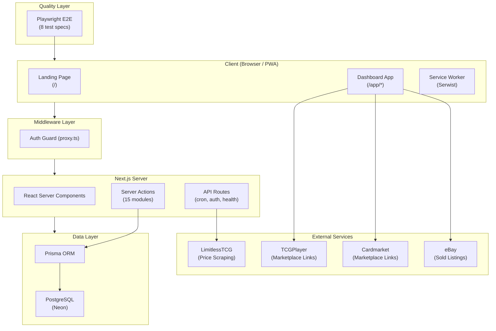
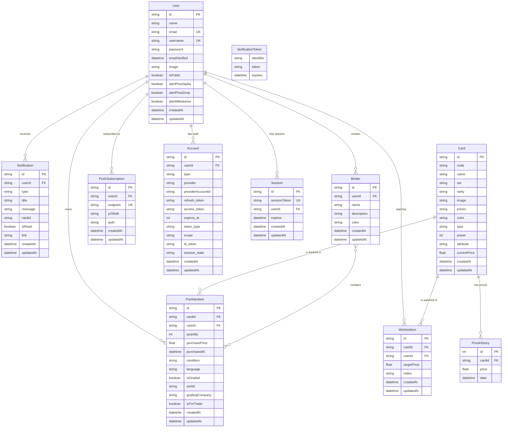

# OPTCG Tracker — Complete Project Documentation

> **One Piece TCG Portfolio Tracker** — A Finary-inspired fintech application for tracking, analyzing, and managing One Piece Trading Card Game collections.

---

## 1. Project Objective

OPTCG Tracker is a **portfolio management platform** purpose-built for One Piece TCG collectors and investors. Inspired by the UX of financial portfolio trackers like [Finary](https://finary.com), it allows users to:

- Track the real-time market value of their card collection
- Monitor price trends and profit/loss (P&L) over time
- Analyze portfolio diversification across sets, colors, types, and rarities
- Manage wishlists with target-price alerts, edit targets, and convert to portfolio
- Export collection data and share public profiles
- Receive notifications on price spikes, drops, and wishlist targets
- Organize collections into binders with custom colors

The app treats **trading cards as investable assets**, providing the same analytical depth collectors would expect from a stock or crypto portfolio tracker.

---

## 2. Tech Stack

| Layer | Technology | Version | Purpose |
|---|---|---|---|
| **Framework** | Next.js (App Router) | 16.1.6 | Full-stack React framework with SSR, RSC, and Server Actions |
| **Language** | TypeScript | ^5 | Type-safe development across frontend and backend |
| **Runtime** | React | 19.2.3 | UI rendering with Server and Client Components |
| **Database** | PostgreSQL | — | Persistent storage (hosted on [Neon](https://neon.tech)) |
| **ORM** | Prisma | ^6.0.0 | Type-safe database queries, migrations, and schema management |
| **Auth Adapter** | @auth/prisma-adapter | ^2.11.1 | Prisma adapter for NextAuth.js |
| **Authentication** | NextAuth.js | ^5.0.0-beta.30 | Credentials-based auth with JWT sessions |
| **Styling** | TailwindCSS v4 | ^4 | Utility-first CSS with custom dark theme design tokens |
| **Charts** | Recharts | ^3.7.0 | Interactive data visualization (area, bar, pie, radar charts) |
| **Animations** | Framer Motion | ^12.33.0 | Page transitions, micro-animations, and interactive effects |
| **State Management** | Zustand | ^5.0.11 | Client-side persisted settings (currency, display name) |
| **Validation** | Zod | ^4.3.6 | Schema validation for all server actions and forms |
| **Icons** | Lucide React | ^0.563.0 | Consistent icon library |
| **Date Handling** | date-fns | ^4.1.0 | Date formatting and time-range calculations |
| **PWA** | Serwist (+ @serwist/next) | ^9.5.6 | Service worker, precaching, and offline support |
| **Password Hashing** | bcryptjs | ^3.0.3 | Secure credential storage |
| **CSS Utilities** | clsx + tailwind-merge | ^2.1.1 / ^3.4.0 | Conditional and conflict-free class composition |
| **Themes** | next-themes | ^0.4.6 | Dark/light mode toggle with system preference detection |
| **E2E Testing** | Playwright | ^1.59.1 | End-to-end test automation for critical user flows |
| **TS Execution** | ts-node | ^10.9.2 | TypeScript script execution for seed and utility scripts |
| **Push Notifications** | web-push | ^3.6.7 | Server-side Web Push protocol implementation |

---

## 3. Architecture

### 3.1 High-Level Architecture



### 3.2 Subfolder-Based Routing

The application uses a **standard subfolder-based routing architecture** with clear separation between public and authenticated areas:

| Path Pattern | Routing Target | Content |
|---|---|---|
| `/` (root) | `app/page.tsx` | Public landing page, legal pages (terms, privacy) |
| `/login` / `/register` | `app/(auth)/*` | Authentication pages |
| `/app/*` | `app/app/(dashboard)/*` | Authenticated dashboard application |
| `/api/*` | `app/api/*` | Shared API routes (auth, cron, health) |
| `/p/[username]` | `app/p/[username]` | Public portfolio profiles |

Authentication is enforced at the middleware level (`proxy.ts`) for all routes starting with `/app`.

### 3.3 Application Layer Structure

```
app/
├── layout.tsx              # Root layout (fonts, theme, toast provider)
├── globals.css             # Design system tokens and utilities
├── page.tsx                # Public landing page
├── global-error.tsx        # Global error boundary
├── privacy/                # Privacy policy
├── terms/                  # Terms of service
├── sw.ts                   # Service worker definition
│
├── (auth)/                 # Authentication
│   ├── login/              # Login page
│   └── register/           # Registration page
│
├── api/                    # Shared API routes
│   ├── auth/               # NextAuth API route
│   ├── cron/               # CRON endpoints (update-prices)
│   └── health/             # Health check
│
├── app/                    # Main Dashboard App
│   └── (dashboard)/
│       ├── layout.tsx      # Dashboard shell (sidebar + Command Palette)
│       ├── page.tsx        # Main dashboard
│       ├── loading.tsx     # Suspense loading state
│       ├── error.tsx       # Error boundary
│       ├── not-found.tsx   # 404 page
│       ├── cards/          # Card catalog + premium detail pages
│       ├── portfolio/      # Portfolio management (grid/table, inline edits)
│       ├── wishlist/       # Wishlist tracking (grid/table, edit modal, convert)
│       ├── performance/    # Performance analytics with clickable card links
│       ├── allocation/     # Asset allocation analytics
│       ├── sets/[setId]/   # Set completion tracking
│       └── settings/       # User settings
│
└── p/
    └── [username]/         # Public portfolio profiles
```

### 3.4 Component Architecture

```
components/
├── cards/                  # Card-specific interactive components
│   ├── AddCardModal.tsx           # Multi-step card addition with search
│   ├── AddWishlistModal.tsx       # Wishlist item creation
│   ├── CardDetailsModal.tsx       # Full card detail overlay
│   ├── CardSearch.tsx             # Debounced search with results
│   ├── ConvertToPortfolioModal.tsx    # Wishlist → Portfolio conversion
│   ├── EditPortfolioItemModal.tsx     # Inline portfolio editing (+ traded checkbox)
│   └── EditWishlistItemModal.tsx      # Wishlist item editing (+ mark acquired)
│
├── dashboard/              # Dashboard-specific widgets
│   ├── CommandMenu.tsx              # Global Command Palette (Cmd+K)
│   ├── DashboardClient.tsx          # Main dashboard orchestrator (modular)
│   ├── DashboardHero.tsx            # Dashboard hero section (KPI cards)
│   ├── DashboardShell.tsx           # Layout wrapper (client component with hotkeys)
│   ├── DashboardArsenalFilters.tsx  # Arsenal search/filter/sort controls
│   ├── DashboardArsenalGrid.tsx     # Arsenal card grid + pagination
│   ├── DashboardModals.tsx          # Dashboard modal orchestration
│   ├── DashboardPerformanceSection.tsx # Performance chart + allocation
│   ├── Sidebar.tsx                  # Dashboard sidebar shell
│   ├── SidebarNav.tsx               # Premium Floating Dock (Mobile)
│   ├── UserProfile.tsx              # User profile dropdown
│   ├── PortfolioStats.tsx           # Statistics cards (total value, P&L)
│   ├── PortfolioGridItem.tsx        # Single card grid item
│   ├── PortfolioSkeleton.tsx        # Loading skeleton for portfolio
│   ├── PriceChart.tsx               # Recharts price history chart
│   ├── AssetAllocation.tsx          # Allocation pie/bar charts
│   ├── CollectionHeatmap.tsx        # Set heatmap visualization
│   ├── CollectionMastery.tsx        # Mastery/completion tracking
│   ├── InsightCard.tsx              # Insight/KPI cards
│   ├── TreasuredGems.tsx            # Featured/valuable cards
│   ├── NotificationCenter.tsx       # Notifications UI
│   ├── NotificationItem.tsx         # Single notification
│   ├── OnboardingModal.tsx          # Onboarding flow
│   └── BinderModal.tsx              # Binder management
│
├── providers/
│   └── theme-provider.tsx       # next-themes wrapper
│
└── ui/                     # Shared UI primitives
    ├── CardImage.tsx            # Optimized Next/Image for card art
    ├── ConfirmModal.tsx         # Reusable confirmation dialog
    ├── EmptyState.tsx           # Reusable empty state component
    ├── ErrorState.tsx           # Reusable error state component
    ├── HoloCard.tsx             # Holographic card effect component
    ├── Skeleton.tsx             # Loading skeleton
    └── toast.tsx                # Toast notification system
```

### 3.5 Server/Client Boundary Strategy

To keep the application fast and SEO-friendly, the dashboard follows a specific layout pattern (documented in `docs/REF_PATTERNS.md`):

**Pattern**: `DashboardLayout` (Server) → `DashboardShell` (Client) → `Children` (Server)

| Component | Type | Responsibility |
|---|---|---|
| `app/app/(dashboard)/layout.tsx` | Server Component | Async data fetching, auth verification |
| `components/dashboard/DashboardShell.tsx` | Client Component | Interactive elements (hotkeys, modals, state) |
| `components/dashboard/Sidebar.tsx` | Server Component | Static navigation (no client-side hydration) |
| `components/dashboard/UserProfile.tsx` | Server Component | User display (no interactive state) |

**Guideline**: If a component exceeds **300 lines**, extract its state and logic into a custom hook (e.g., `usePortfolioFilters` reduced `PortfolioClient.tsx` from 1270 to ~400 lines).

### 3.6 Middleware & Routing

The middleware is defined in `proxy.ts` (Next.js 16 convention):

```
NextAuth(authConfig).auth → Route Protection
```

- **Auth Guard**: NextAuth authorized callback protects all `/app/*` routes.
- **Matcher Pattern**: Excludes static files, images, `manifest.json`, and `sw.js`.

```
matcher: ['/((?!_next/static|_next/image|.*\\.(?:png|ico|svg|webp|jpg|jpeg)$|manifest\\.json|sw\\.js).*)']
```

### 3.7 Performance Standards

From `docs/REF_PATTERNS.md`:

| Standard | Implementation |
|---|---|
| **Dynamic Imports** | `next/dynamic` for all heavy modals and charting libraries (e.g., `recharts`) |
| **Skeleton Screens** | Every major view has a `Skeleton` component (e.g., `PortfolioSkeleton.tsx`) to eliminate CLS |
| **Suspense Transitions** | `<Suspense fallback={<Skeleton />}>` at page level for data-heavy views |
| **Component Modularity** | Large views split into sub-components: `PortfolioStats`, `PortfolioGridItem`, `PortfolioTable` |
| **Centralized Logic** | All P&L math in `lib/utils/calculations.ts` — never inline in components |

---

## 4. Features

### 4.1 Dashboard (Main Hub)

The dashboard is the central hub providing:

- **Portfolio Value Summary** — Total value, total cost, P&L (absolute + percentage)
- **Portfolio Value Chart** — Interactive area chart with configurable time ranges (7D, 1M, 3M, 6M, MAX)
- **Quick Stats** — Card count, unique cards, average card value
- **Treasured Gems** — Top 5 most valuable cards with holographic card effects
- **Asset Allocation Widget** — Pie chart breakdown by set
- **Collection Mastery** — Set completion progress bars
- **Collection Heatmap** — Visual representation of collection density
- **Dynamic Insights** — AI-style contextual recommendations (concentration risk, star performers, buying opportunities)
- **Notification Center** — Real-time alerts for price movements and targets
- **Onboarding Modal** — First-time user walkthrough
- **CSV Export & Import** — One-click portfolio export and mass import logic with CSV.

### 4.2 Card Catalog & Immersive Details

- **Browse All Cards** — Full card database with server-side pagination
- **Multi-Filter System** — Filter by set, color, rarity, and card type
- **Search** — Real-time search by name, code, or set
- **Premium Card Details** — An immersive, full-screen card view featuring:
  - **Breadcrumb Navigation** — `Cards > Card Name (Card Code)` with immediate navigation back to the catalog.
  - **Set Link** — Clickable set name redirects to the specific set completion page.
  - **My Holdings Integration**: Direct visibility of your owned quantity, average cost basis, and unrealized P&L for that specific card.
  - **Marketplace Links**: Deep links to TCGPlayer, Cardmarket, and eBay sold listings.
  - **Price History**: 90-day interactive price chart.
- **Quick Actions** — Add to portfolio or wishlist directly from catalog or detail page.

### 4.3 Portfolio Management

- **Collection Overview** — All owned cards with current values and P&L
- **View Modes** — Toggle between grid and table views
- **Add Cards** — Multi-step modal with card search, condition, language, and grading details
- **Click-to-Edit** — Clicking any card (grid or table) opens the edit modal
- **Inline Editing (Table)** — Edit quantity and cost directly in the table row (blur or Enter to save, with inline validation)
- **Multi-Select via Checkboxes** — Select cards using checkboxes for bulk operations:
  - Click checkbox to toggle selection
  - Ctrl/Cmd+Click for individual toggle
  - Shift+Click for range selection
- **Bulk Delete** — Multi-select and batch remove items
- **Trade Flagging** — Mark cards as "For Trade" (checkbox in edit modal)
- **Sorting** — Sort by any column (name, value, P&L, date added, etc.)
- **CSV Export / Import** — Full portfolio export with P&L calculations, and a complete Bulk Import feature supporting drag-and-drop CSV validation for fast collection addition.
- **Weighted Average Cost Basis** — Automatically calculates average price when adding same card
- **Market Timing Badge** — Each card gets a "Diamond Hand" / "Fair Value" / "FOMO" badge based on purchase timing vs. historical price
- **Binder Tabs** — Quick filter by binder or "For Trade"

### 4.4 Wishlist 2.0

- **Watch Cards** — Add cards with a target buy price
- **View Modes** — Toggle between grid and table views
- **Filters** — Filter by set and status (`All`, `At Target`, `Watching`)
- **Search & Filter** — Real-time searching within your wishlist items
- **Quick-Add Flow** — Add cards to your wishlist directly from a built-in search modal
- **Click-to-Edit** — Clicking any wishlist card opens the edit modal
- **Edit Modal** — Edit target price and notes, with a **Mark Acquired** button for quick conversion
- **Target Price Alerts** — Automatic notifications and highlighted "Active Alerts" when market price drops below target
- **Convert to Portfolio** — One-click conversion from wishlist to portfolio with purchase price tracking
- **Table View** — Full table with card, set, current price, target price, status, and action columns

### 4.5 Asset Allocation

Interactive analytics page with four allocation views:

| Dimension | Visualization |
|---|---|
| **By Set** | Pie chart with set-specific colors |
| **By Color** | Pie chart with TCG color mapping (Red, Green, Blue, Purple, Black, Yellow, multi-color) |
| **By Type** | Bar chart (Leader, Character, Event, Stage, etc.) |
| **By Rarity** | Bar chart (Common, Uncommon, Rare, Super Rare, Secret Rare, etc.) |
| **Set Completion** | Progress bars showing unique cards owned vs. total per set |

### 4.6 Performance Analytics

- **30-Day Value vs. Cost Chart** — Dual-line area chart showing portfolio value against cost basis over time
- **Top Movers** — Top 5 cards by absolute 24h price change percentage
- **Clickable Card Names** — Click any top mover name to navigate to its card detail page
- **Dynamic Insights** — Auto-generated insights including:
  - Concentration risk warnings (>40% in one set)
  - Star performer highlights (>10% daily gain)
  - Significant drop alerts (>10% daily loss)
  - Wishlist buying opportunities (cards at or below target price)
- **Manual Price Sync** — Button with detailed feedback (updated/skipped/errors/duration)

### 4.7 Set Completion Tracking

- **Set Overview** — All sets sorted by completion percentage
- **Dual Metrics** — "Core" completion (unique card codes) vs. "Mastery" completion (all variants including alt-arts)
- **Individual Set Pages** — Full card grid showing owned vs. missing cards with quantities

### 4.8 Binders (Collection Organization)

- **Create Binders** — Named binders with description and color customization
- **Assign Cards** — Add/remove portfolio items to binders
- **CRUD Operations** — Full create, read, update, delete support

### 4.9 Notifications System

Automated notifications triggered during price updates:

| Notification Type | Trigger Condition |
|---|---|
| **PRICE_SPIKE** | Card price increases >=15% since last update |
| **PRICE_DROP** | Card price decreases >=15% since last update |
| **WISHLIST_TARGET** | Card price drops below user's target price |
| **MILESTONE** | Portfolio milestone reached (configurable) |

- Notification center with unread count badge
- Mark as read (individual / all)
- Delete notifications
- Per-user alert preference toggles (spikes, drops, milestones)
- **Notification Cooldown** — 12-hour cooldown per card/type to prevent spam
- **Web Push Notifications** — Real-time alerts delivered via Service Worker (Push API), supported after user opt-in in settings.

### 4.10 Public Portfolio Profiles

- **Shareable Profiles** — Public URL at `/p/[username]`
- **Privacy Toggle** — Users control visibility in settings
- **Public Data** — Shows portfolio items, wishlist, card stats, and total value
- **Cards sorted by value** — Most valuable cards shown first

### 4.11 User Settings

- **Theme Toggle** — Dark / Light / System modes
- **Multi-Currency** — Display values in USD, EUR, or JPY (persisted via Zustand)
- **Profile Management** — Update display name, username, password
- **Alert Preferences** — Toggle price spike, price drop, and milestone alerts
- **Public Profile** — Enable/disable public portfolio sharing
- **Reset Portfolio** — Nuclear option to wipe all portfolio items, wishlist, and notifications

### 4.12 Global Command Palette (`Cmd+K`)

- **Lightning Fast Navigation** — Instant access to Portfolio, Catalog, Wishlist, and Settings from anywhere.
- **Quick Search** — Fuzzy search logic for pages and core application areas.
- **Keyboard Optimization** — Full keyboard support for professional users.

### 4.13 Premium Mobile Experience (PWA)

- **Floating Dock Navigation** — A sleek, glassmorphic floating navigation bar optimized for thumb reach.
- **Quick Search Button** — Central action button for instant access to the command palette on mobile.
- **Service Worker** — Serwist-based offline support and precaching.
- **Native Look & Feel** — Optimized safe areas and interactive micro-animations.
- **iOS Push Support** — Integrated "Add to Home Screen" guidance in settings to enable Push API on iOS 16.4+.

---

## 5. Constants & Enums Reference

All constants are defined in `lib/constants.ts` as the single source of truth.

### 5.1 SET_COLORS

Maps One Piece TCG set names to hex color values for charts and UI:

| Set Name | Hex Color |
|---|---|
| Romance Dawn | `#fbbf24` (amber) |
| Awakening of the New Era | `#f97316` (orange) |
| Straw Hat Crew | `#22c55e` (green) |
| Paramount War | `#ef4444` (red) |
| Pillars of Strength | `#a855f7` (purple) |
| Kingdoms of Intrigue | `#3b82f6` (blue) |
| Twin Champions | `#06b6d4` (cyan) |
| The Three Captains | `#ec4899` (pink) |

`getSetColor(set: string): string` — Returns the set color or fallback `#6b7280` (gray).

### 5.2 COLOR_MAP

Maps card colors (including multi-colors) to hex values:

| Card Color | Hex Color |
|---|---|
| Red | `#ef4444` |
| Green | `#22c55e` |
| Blue | `#3b82f6` |
| Purple | `#a855f7` |
| Black | `#1f2937` |
| Yellow | `#eab308` |
| Red/Green | `#d97706` |
| Red/Black | `#7f1d1d` |
| Blue/Purple | `#6366f1` |
| Red/Yellow | `#f59e0b` |

### 5.3 GRADE_OPTIONS

PSA-style grading scale (12 tiers):

| Value | Label |
|---|---|
| 10 | Pristine/Gem Mint |
| 9.5 | Mint+ |
| 9 | Mint |
| 8.5 | NM-MT+ |
| 8 | NM-MT |
| 7 | NM |
| 6 | EX-MT |
| 5 | EX |
| 4 | VG-EX |
| 3 | VG |
| 2 | Good |
| 1 | Poor |

### 5.4 LANGUAGE_OPTIONS

| Value | Label |
|---|---|
| EN | English |
| JP | Japanese |
| FR | French |
| IT | Italian |

### 5.5 CARD_STATUS_OPTIONS

| Value | Label |
|---|---|
| Raw | Raw (Ungraded) |
| Graded | Graded |
| Sealed | Sealed Product |

### 5.6 GRADING_COMPANY_OPTIONS

| Value | Label |
|---|---|
| PSA | PSA |
| BGS | Beckett (BGS) |
| CGC | CGC |
| PCG | PCG |
| Other | Other |

---

## 6. TypeScript Types & Interfaces

### 6.1 Card Interface (`types/index.ts`)

```typescript
interface Card {
    id: string;           // e.g. "OP01-001"
    name: string;
    set: string;
    code: string;         // The card code visible on card
    rarity: string;
    image: string;
    currentPrice: number; // Current market price
    history?: { date: string; value: number }[];
}
```

### 6.2 PortfolioItem Interface (`types/index.ts`)

```typescript
interface PortfolioItem {
    id: string;                    // UUID for the entry
    cardId: string;
    name: string;
    image: string;
    set: string;
    code: string;
    rarity: string;
    quantity: number;
    purchasePrice: number;         // Per-card cost basis
    currentPrice: number;          // Latest market price
    dateAdded: string;
    condition: string;
    language: string;
    isGraded: boolean;
    certId?: string | null;
    gradingCompany?: string | null;
    isForTrade?: boolean;
    history?: { date: string; value: number }[];
}
```

### 6.3 Derived Types

| Type | Location | Fields |
|---|---|---|
| `PnLResult` | `lib/utils/calculations.ts` | `cost`, `value`, `pnl`, `pnlPercent` |
| `TimingBadge` | `lib/performance.ts` | `'Diamond Hand' \| 'Fair Value' \| 'FOMO' \| 'N/A'` |
| `SortField` | `lib/hooks/use-portfolio-filters.ts` | `'name' \| 'set' \| 'quantity' \| 'purchasePrice' \| 'currentPrice' \| 'pnl'` |
| `SortOrder` | `lib/hooks/use-portfolio-filters.ts` | `'asc' \| 'desc'` |
| `BinderWithItems` | `lib/hooks/use-portfolio-filters.ts` | `{ id, name, color, items: { id }[] }` |
| `PriceUpdateResult` | `lib/actions/prices.ts` | `'updated' \| 'skipped' \| 'error'` |
| `RateLimitConfig` | `lib/rate-limit.ts` | `{ maxRequests, windowMs }` |

### 6.4 Zod Inferred Types (`lib/validations.ts`)

All exported for use in server actions:

- `RegisterInput` — inferred from `registerSchema`
- `LoginInput` — inferred from `loginSchema`
- `AddToPortfolioInput` — inferred from `addToPortfolioSchema`
- `UpdatePortfolioItemInput` — inferred from `updatePortfolioItemSchema`
- `AddToWishlistInput` — inferred from `addToWishlistSchema`
- `UpdateProfileInput` — inferred from `updateProfileSchema`

---

## 7. Database Schema

The application uses **10 Prisma models** across a PostgreSQL database.

### 7.1 Entity Relationship Diagram



### 7.2 Model Details

#### Card

| Field | Type | Default | Nullable | Notes |
|---|---|---|---|---|
| `id` | String | — | No | `@id` |
| `code` | String | — | No | Card code (e.g., `OP01-001`) |
| `name` | String | — | No | Card name |
| `set` | String | — | No | Set name |
| `rarity` | String | — | No | Rarity tier |
| `image` | String | — | Yes | Image URL |
| `prices` | String | — | Yes | JSON price data |
| `color` | String | — | Yes | Card color(s) |
| `type` | String | — | Yes | Card type (Leader, Character, etc.) |
| `power` | Int | — | Yes | Card power value |
| `attribute` | String | — | Yes | Card attribute |
| `currentPrice` | Float | `0` | No | Latest market price |
| `createdAt` | DateTime | `now()` | No | |
| `updatedAt` | DateTime | `@updatedAt` | No | |

#### PortfolioItem

| Field | Type | Default | Nullable | Notes |
|---|---|---|---|---|
| `id` | String | `uuid()` | No | `@id` |
| `cardId` | String | — | No | FK → Card |
| `quantity` | Int | — | No | |
| `purchasePrice` | Float | — | No | Per-card cost basis |
| `purchasedAt` | DateTime | `now()` | No | Date of purchase |
| `userId` | String | — | Yes | FK → User (cascade delete) |
| `condition` | String | `"Raw"` | No | |
| `isGraded` | Boolean | `false` | No | |
| `language` | String | `"EN"` | No | |
| `certId` | String | — | Yes | Grading certificate ID |
| `gradingCompany` | String | — | Yes | PSA, BGS, etc. |
| `isForTrade` | Boolean | `false` | No | Trade flag |
| `createdAt` | DateTime | `now()` | No | |
| `updatedAt` | DateTime | `@updatedAt` | No | |

Relations: `card` (Card), `user` (User, onDelete: Cascade), `binders` (Binder[], many-to-many via `BinderToPortfolioItem`)

#### WishlistItem

| Field | Type | Default | Nullable | Notes |
|---|---|---|---|---|
| `id` | String | `uuid()` | No | `@id` |
| `cardId` | String | — | No | FK → Card |
| `targetPrice` | Float | — | No | Target buy price |
| `notes` | String | — | Yes | Max 500 chars |
| `userId` | String | — | Yes | FK → User (cascade delete) |
| `createdAt` | DateTime | `now()` | No | |
| `updatedAt` | DateTime | `@updatedAt` | No | |

Unique constraint: `@@unique([cardId, userId])` — one wishlist entry per card per user.

#### User

| Field | Type | Default | Nullable | Notes |
|---|---|---|---|---|
| `id` | String | `cuid()` | No | `@id` |
| `name` | String | — | Yes | Display name |
| `email` | String | — | Yes | `@unique` |
| `username` | String | — | Yes | `@unique` |
| `password` | String | — | Yes | bcrypt hashed |
| `emailVerified` | DateTime | — | Yes | |
| `image` | String | — | Yes | Avatar URL |
| `alertMilestones` | Boolean | `true` | No | |
| `alertPriceDrop` | Boolean | `true` | No | |
| `alertPriceSpike` | Boolean | `true` | No | |
| `isPublic` | Boolean | `false` | No | Public profile toggle |
| `createdAt` | DateTime | `now()` | No | |
| `updatedAt` | DateTime | `@updatedAt` | No | |

Relations: `accounts[]`, `binders[]`, `notifications[]`, `portfolioItems[]`, `sessions[]`, `wishlistItems[]` — all cascade on user delete.

#### Notification

| Field | Type | Default | Nullable | Notes |
|---|---|---|---|---|
| `id` | String | `cuid()` | No | `@id` |
| `userId` | String | — | No | FK → User (cascade delete) |
| `type` | String | — | No | `PRICE_SPIKE`, `PRICE_DROP`, `WISHLIST_TARGET`, `MILESTONE` |
| `title` | String | — | No | |
| `message` | String | — | No | |
| `cardId` | String | — | Yes | Related card ID |
| `isRead` | Boolean | `false` | No | |
| `link` | String | — | Yes | Deep link (e.g., `/cards/{id}`, `/wishlist`) |
| `createdAt` | DateTime | `now()` | No | |
| `updatedAt` | DateTime | `@updatedAt` | No | |

#### Binder

| Field | Type | Default | Nullable | Notes |
|---|---|---|---|---|
| `id` | String | `uuid()` | No | `@id` |
| `name` | String | — | No | |
| `description` | String | — | Yes | |
| `color` | String | — | Yes | Hex color for UI |
| `userId` | String | — | No | FK → User (cascade delete) |
| `createdAt` | DateTime | `now()` | No | |
| `updatedAt` | DateTime | `@updatedAt` | No | |

Relations: `user` (User), `items` (PortfolioItem[], many-to-many via `BinderToPortfolioItem`)

#### PushSubscription

| Field | Type | Default | Nullable | Notes |
|---|---|---|---|---|
| `id` | String | `cuid()` | No | `@id` |
| `userId` | String | — | No | FK → User (cascade delete) |
| `endpoint` | String | — | No | `@unique` Push service endpoint |
| `p256dh` | String | — | No | Client public key |
| `auth` | String | — | No | Auth secret |
| `createdAt` | DateTime | `now()` | No | |
| `updatedAt` | DateTime | `@updatedAt` | No | |

#### PriceHistory

| Field | Type | Default | Notes |
|---|---|---|---|
| `id` | Int | `autoincrement()` | `@id` |
| `cardId` | String | — | FK → Card |
| `price` | Float | — | Price at snapshot |
| `date` | DateTime | `now()` | |

#### Account, Session, VerificationToken

Standard NextAuth.js models for OAuth provider storage, session management, and email verification.

### 7.3 Key Indexes

| Model | Index | Type |
|---|---|---|
| `PriceHistory` | `[cardId]` | Index |
| `PriceHistory` | `[date]` | Index |
| `PriceHistory` | `[cardId, date]` | Composite index |
| `PortfolioItem` | `[userId]` | Index |
| `PortfolioItem` | `[cardId]` | Index |
| `WishlistItem` | `[cardId, userId]` | Unique constraint |
| `WishlistItem` | `[userId]` | Index |
| `Notification` | `[userId]` | Index |
| `Notification` | `[createdAt]` | Index |
| `Binder` | `[userId]` | Index |
| `Account` | `[provider, providerAccountId]` | Unique constraint |
| `Session` | `sessionToken` | Unique |
| `User` | `email` | Unique |
| `User` | `username` | Unique |
| `VerificationToken` | `[identifier, token]` | Unique constraint |

### 7.4 Prisma Client Singleton

`lib/db.ts` implements a global singleton pattern to prevent connection pool exhaustion during development hot reload:

```typescript
const prisma = globalThis.prisma ?? new PrismaClient();
if (process.env.NODE_ENV !== 'production') globalThis.prisma = prisma;
```

---

## 8. Server Actions (Data Layer)

All data mutations and queries are implemented as **Next.js Server Actions** with `'use server'` directives:

| Module | Key Functions | Purpose |
|---|---|---|
| `portfolio.ts` | `addToPortfolio`, `removeFromPortfolio`, `bulkRemoveFromPortfolio`, `updatePortfolioItem`, `toggleTradeStatus`, `getPortfolioItems`, `resetPortfolio` | Full portfolio CRUD + trade flagging + inline edits |
| `cards.ts` | Card querying with pagination and filters | Card catalog data fetching |
| `wishlist.ts` | `addToWishlist`, `removeFromWishlist`, `updateWishlistItem`, `convertWishlistToPortfolio`, `getWishlistItems`, `getWishlistAlerts` | Wishlist management with edit + convert |
| `prices.ts` | `updateAllCardPrices`, `fetchPriceForCard` | Price scraping from LimitlessTCG with batch concurrency, timeout protection, notification cooldown, and execution telemetry |
| `performance.ts` | `getPerformanceData`, `generateInsights` | 30-day performance charts, top movers, dynamic insights |
| `allocation.ts` | `getAllocationData` | Asset breakdown by set, color, type, rarity + set completion |
| `history.ts` | `getPortfolioHistory` | Historical portfolio value with configurable ranges (7D-MAX) |
| `notifications.ts` | `getNotifications`, `markAsRead`, `markAllAsRead`, `deleteNotification` | Notification management |
| `binders.ts` | `getBinders`, `createBinder`, `updateBinder`, `deleteBinder`, `addItemsToBinder`, `removeItemsFromBinder` | Collection organization |
| `set-progress.ts` | `getSetProgress`, `getAllSetsProgress` | Set completion with dual core/mastery metrics |
| `export.ts` | `exportPortfolioCSV` | CSV export with full P&L and summary |
| `auth-actions.ts` | `login`, `register`, `handleSignOut` | Authentication flows |
| `user.ts` | User profile updates | Profile management |
| `user-settings.ts` | `getAlertPreferences`, `updateAlertPreferences`, `updatePublicVisibility`, `savePushSubscription`, `deletePushSubscription` | User preferences + Push management |
| `public-portfolio.ts` | `getPublicPortfolio` | Public profile data fetching |

**Data pattern** used by all server actions:

```
1. Check authentication (session.user.id)
2. Validate input with Zod schema
3. Execute Prisma query/mutation
4. revalidatePath('/', 'layout') for ISR cache invalidation
5. Return { success, data } or { error }
```

---

## 9. Utility Functions & Hooks

### 9.1 Class Merging — `cn()`

**Location**: `lib/utils.ts`

Combines `clsx` + `tailwind-merge` for conflict-free conditional class composition:

```typescript
function cn(...inputs: ClassValue[]): string
```

### 9.2 Financial Calculations

**Location**: `lib/utils/calculations.ts`

| Function | Signature | Returns |
|---|---|---|
| `calculatePnL` | `(quantity, purchasePrice, currentPrice)` | `PnLResult { cost, value, pnl, pnlPercent }` |
| `aggregatePnL` | `(items: { quantity, purchasePrice, currentPrice }[])` | `PnLResult` (aggregated totals) |
| `formatPnLPrefix` | `(pnl: number)` | `'+'` if positive, `''` otherwise |
| `getPnLColor` | `(pnl: number)` | `'text-green-400'` / `'text-red-400'` / `'text-muted-foreground'` |

**Logic**: `cost = quantity * purchasePrice`, `value = quantity * currentPrice`, `pnlPercent = cost > 0 ? (pnl / cost) * 100 : 0`.

### 9.3 Market Timing Badge

**Location**: `lib/performance.ts`

```typescript
function getMarketTimingBadge(purchasePrice: number, history: PriceHistory[]): { badge: TimingBadge; color: string }
```

| Badge | Condition | Color |
|---|---|---|
| **Diamond Hand** | Purchase price <= historic low * 1.1 (within 10%) | `text-amber-400` |
| **FOMO** | Purchase price > average price * 1.3 (30%+ premium) | `text-red-400` |
| **Fair Value** | Otherwise | `text-blue-400` |
| **N/A** | No price history available | `text-muted-foreground` |

### 9.4 Marketplace URL Builders

**Location**: `lib/marketplace.ts`

| Function | URL Pattern |
|---|---|
| `getTCGPlayerUrl(name, code)` | `tcgplayer.com/search/one-piece-card-game/product?q={name}+{code}+One+Piece&view=grid` |
| `getCardmarketUrl(name, code)` | `cardmarket.com/en/OnePiece/Products/Search?searchString={name}+{code}` |
| `getEbayUrl(name, code)` | `ebay.com/sch/i.html?_nkw=One+Piece+TCG+{name}+{code}&LH_Sold=1&LH_Complete=1` |

### 9.5 useCurrency Hook

**Location**: `lib/hooks/use-currency.ts`

| Aspect | Detail |
|---|---|
| **Exchange Rate API** | `open.er-api.com/v6/latest/USD` |
| **Cache Strategy** | `localStorage` key `optcg_exchange_rates`, 12-hour TTL |
| **Default Rates** | USD = 1, EUR = 0.92, JPY = 150.0 |
| **Currency Config** | USD (`$`, `en-US`), EUR (`euro`, `fr-FR`), JPY (`yen`, `ja-JP`) |
| **Decimal Places** | JPY = 0 decimals, USD/EUR = 2 decimals |
| **Returns** | `{ format, convert, currency, symbol, rate, lastUpdated }` |

### 9.6 usePortfolioFilters Hook

**Location**: `lib/hooks/use-portfolio-filters.ts`

**Parameters**: `(items: PortfolioItem[], binders: BinderWithItems[])`

**Sort Fields**: `name`, `set`, `quantity`, `purchasePrice`, `currentPrice`, `pnl`

**Filter Dimensions**:

| Filter | Options | Logic |
|---|---|---|
| `search` | Free text | Case-insensitive match on name, code, or set |
| `filterSet` | `'All'` or unique set name | Exact match on `item.set` |
| `filterRarity` | `'All'` or unique rarity | Exact match on `item.rarity` |
| `filterPnL` | `'All'`, `'Gain'`, `'Loss'` | P&L > 0 for Gain, P&L < 0 for Loss |
| `activeBinderId` | `null`, binder ID, or `'trade'` | Special `'trade'` value filters `isForTrade` items |

**Returns**: `search`, `setSearch`, `sortField`, `sortOrder`, `filterSet`, `filterRarity`, `filterPnL`, `activeBinderId`, `uniqueSets`, `uniqueRarities`, `filteredItems`, `sortedItems`, `handleSort`, `clearFilters` + all setters.

---

## 10. State Management

### 10.1 Zustand Settings Store

**Location**: `lib/settings-store.ts`

```typescript
interface SettingsState {
    currency: 'USD' | 'EUR' | 'JPY';   // default: 'USD'
    displayName: string;                 // default: 'Guest User'
    setCurrency: (currency: 'USD' | 'EUR' | 'JPY') => void;
    setDisplayName: (name: string) => void;
}
```

- **Persistence**: `zustand/middleware` persist with key `one-piece-settings-storage` (localStorage)
- **Usage**: `const { currency } = useSettingsStore()`

---

## 11. Validation Schemas

All schemas are defined in `lib/validations.ts` using Zod.

### 11.1 registerSchema

| Field | Type | Constraints |
|---|---|---|
| `username` | string | 3-30 chars, regex `/^[a-zA-Z0-9_-]+$/` (alphanumeric + hyphens + underscores) |
| `password` | string | 8-100 chars |
| `confirmPassword` | string | Must match `password` (`.refine()`) |

### 11.2 loginSchema

| Field | Type | Constraints |
|---|---|---|
| `username` | string | min 1 (required) |
| `password` | string | min 1 (required) |

### 11.3 addToPortfolioSchema

Array (min 1 item) of objects:

| Field | Type | Constraints | Default |
|---|---|---|---|
| `cardId` | string | min 1 (required) | — |
| `quantity` | number | int, 1-9999 | — |
| `purchasePrice` | number | 0-1,000,000 | — |
| `condition` | string | — | `"Raw"` |
| `language` | string | — | `"EN"` |
| `isGraded` | boolean | — | `false` |
| `certId` | string | optional, nullable | — |
| `gradingCompany` | string | optional, nullable | — |

### 11.4 updatePortfolioItemSchema

All fields optional:

| Field | Type | Constraints |
|---|---|---|
| `quantity` | number | int, 1-9999 |
| `purchasePrice` | number | 0-1,000,000 |
| `condition` | string | — |
| `language` | string | — |
| `isGraded` | boolean | — |
| `isForTrade` | boolean | — |
| `certId` | string | nullable |
| `gradingCompany` | string | nullable |

### 11.5 addToWishlistSchema

| Field | Type | Constraints |
|---|---|---|
| `cardId` | string | min 1 (required) |
| `targetPrice` | number | 0.01-100,000 |
| `notes` | string | max 500, optional |

### 11.6 updateProfileSchema

| Field | Type | Constraints |
|---|---|---|
| `name` | string | max 50, optional |
| `username` | string | 3-30, regex `/^[a-zA-Z0-9_-]+$/`, optional |
| `password` | string | 8-100, optional (or empty string via `.or(z.literal(''))`) |

---

## 12. API Endpoints

### 12.1 Health Check — `GET /api/health`

**Auth**: None required

**Response (200)**:
```json
{
    "status": "ok",
    "version": "0.1.0",
    "uptime": 12345.67,
    "db": { "status": "connected", "latencyMs": 5 },
    "timestamp": "2026-04-02T12:00:00.000Z"
}
```

**Error (503)**: Returns `{ status: "error", db: { status: "disconnected" } }` when database is unreachable.

**DB Check**: Raw SQL `SELECT 1` for connectivity test.

### 12.2 Price Update CRON — `GET /api/cron/update-prices`

| Setting | Value |
|---|---|
| `dynamic` | `'force-dynamic'` |
| `maxDuration` | `300` (5 minutes, Vercel function limit) |
| **Schedule** | `*/5 * * * *` (Every 5 minutes via `vercel.json`) |

**Auth**: Bearer token — `Authorization: Bearer {CRON_SECRET}`

- In **production**: `CRON_SECRET` is mandatory; endpoint returns 500 if not set. Automated via Vercel Cron Jobs.
- In **non-production**: Auth enforced only when `CRON_SECRET` is configured.

**Response**:
```json
{
    "success": true,
    "updated": 42,
    "skipped": 150,
    "errors": 3,
    "processed": 195,
    "batchSize": 5,
    "durationMs": 45000,
    "requestDurationMs": 45123,
    "triggeredAt": "2026-04-02T12:00:00.000Z"
}
```

### 12.3 Auth — `/api/auth/[...nextauth]`

Exports `GET` and `POST` handlers from NextAuth.js. Handles login, callback, session, and signout flows.

---

## 13. External Integrations

### 13.1 LimitlessTCG (Price Data Source)

- **Purpose**: Scrapes card prices from `onepiece.limitlesstcg.com/cards/{code}`
- **Method**: HTML scraping with multiple regex patterns for robustness
- **Batch Concurrency**: Processes cards in configurable batches (default: 5) with inter-batch delays
- **Timeout Protection**: 12-second fetch timeout with cleanup via `AbortController`
- **Retry Logic**: Exponential backoff with up to 2 retries per card
- **Notification Cooldown**: 12-hour cooldown per card/type to prevent spam
- **Execution Telemetry**: Tracks `updated`, `skipped`, `errors`, `durationMs`, `batchSize`
- **Trigger**: Via CRON API endpoint (`/api/cron/update-prices`)

### 13.2 Marketplace Deep Links

The app generates deep links to three marketplaces for each card:

| Platform | URL Builder | Purpose |
|---|---|---|
| **TCGPlayer** | `getTCGPlayerUrl()` | Buy/sell with search pre-populated |
| **Cardmarket** | `getCardmarketUrl()` | European marketplace links |
| **eBay** | `getEbayUrl()` | Completed/sold listings for price research |

### 13.3 Card Images

Card images are loaded from two CDN sources:
- `images.limitlesstcg.com`
- `limitlesstcg.s3.us-east-2.amazonaws.com`

Fallback placeholder: `placehold.co`

### 13.4 Exchange Rates

- **Source**: `open.er-api.com/v6/latest/USD`
- **Used by**: `useCurrency` hook for multi-currency conversion
- **Cache**: 12-hour TTL in localStorage

---

## 14. Rate Limiting

**Location**: `lib/rate-limit.ts`

**Algorithm**: In-memory fixed-window rate limiter using a `Map<string, { count, resetTime }>`.

### 14.1 Rate Limit Tiers

| Tier | Max Requests | Window | Use Case |
|---|---|---|---|
| `auth` | 10 | 60 seconds | Login/register attempts |
| `api` | 60 | 60 seconds | General API calls (default) |
| `heavy` | 5 | 60 seconds | Heavy operations (price sync, bulk delete) |

### 14.2 Implementation Details

- **Key Format**: `{type}:{identifier}` (e.g., `auth:username123`)
- **Cleanup**: `setInterval` every 60 seconds removes expired entries
- **Function**: `checkRateLimit(identifier: string, type: 'auth' | 'api' | 'heavy')`
- **Returns**: `{ success: boolean, remaining: number, resetInMs: number }`

---

## 15. Price Update Engine

**Location**: `lib/actions/prices.ts`

### 15.1 Configuration Constants

| Constant | Value | Purpose |
|---|---|---|
| `PRICE_CHANGE_THRESHOLD` | `0.15` (15%) | Minimum change to trigger spike/drop notifications |
| `NOTIFICATION_COOLDOWN_HOURS` | `12` | Hours before re-notifying for same card/type |
| `FETCH_TIMEOUT_MS` | `12,000` | Per-card fetch timeout (AbortController) |
| `PRICE_UPDATE_BATCH_SIZE` | `5` | Cards processed concurrently per batch |
| `PRICE_UPDATE_BATCH_DELAY_MS` | `500` | Delay between batches (rate limiting protection) |

### 15.2 Scraping Strategy

1. **URL**: `https://onepiece.limitlesstcg.com/cards/{code}`
2. **User-Agent**: Chrome 120 spoofing
3. **Timeout**: 12s with `AbortController`
4. **Retry**: Up to 2 retries with exponential backoff (1s, 2s)
5. **Price Extraction** (3 regex patterns tried in order):
   - **Pattern 1**: TCGPlayer price link — `$X.XX</a>`
   - **Pattern 2**: Generic price container — `class="*price*">$X.XX`
   - **Pattern 3**: Fallback — first `$X.XX` occurrence
6. **Validation**: Price must be > 0 and < 100,000

### 15.3 Notification Logic

All operations run within a single `prisma.$transaction`:

1. **Update card price** + create `PriceHistory` entry
2. **Wishlist targets**: If price changed and crossed below a user's `targetPrice`:
   - Check `user.alertMilestones` is enabled
   - Check 12h notification cooldown
   - Create `WISHLIST_TARGET` notification with link to `/wishlist`
3. **Price spikes** (>= +15%): Notify portfolio holders
   - Check `user.alertPriceSpike` is enabled
   - Check 12h cooldown
   - Create `PRICE_SPIKE` notification with link to `/cards/{id}`
4. **Price drops** (<= -15%): Notify portfolio holders
   - Check `user.alertPriceDrop` is enabled
   - Check 12h cooldown
   - Create `PRICE_DROP` notification with link to `/cards/{id}`

### 15.4 Telemetry

`updateAllCardPrices()` returns:

```typescript
{ success: true, updated: number, skipped: number, errors: number, processed: number, batchSize: number, durationMs: number }
```

---

## 16. Security & Authentication

### 16.1 Authentication Architecture

| File | Purpose |
|---|---|
| `auth.config.ts` | Edge-compatible config: callbacks, route protection, JWT strategy |
| `auth.ts` | Full config with Prisma + Credentials provider (not edge-compatible) |
| `proxy.ts` | Next.js 16 middleware wrapping NextAuth auth guard |

**Provider**: Credentials (username + password)
**Strategy**: JWT sessions (no database sessions for performance)
**Password Storage**: bcryptjs hashing
**Config**: `trustHost: true`, `basePath: "/api/auth"`, `secret: AUTH_SECRET`

### 16.2 Authentication Flow

1. **Register**: Validate with `registerSchema` → hash password (bcryptjs) → create User record
2. **Login**: Find user by username → `bcrypt.compare()` → return user object → JWT token created
3. **JWT Callback**: Injects `user.id` into token
4. **Session Callback**: Exposes `token.id` as `session.user.id`

### 16.3 Route Protection

The `authorized()` callback in `auth.config.ts`:

| Route | Behavior |
|---|---|
| `/` (landing) | If logged in → redirect to `/app`; otherwise allow |
| `/login`, `/register` | If logged in → redirect to `/app`; otherwise allow |
| `/app/*` | If logged in → allow; otherwise → redirect to `/login` |
| `/api/*` | Always pass through (handle own auth) |
| Public routes | Always allow |

### 16.4 Authorization

- All server actions verify `session.user.id` before executing
- Ownership checks on update/delete operations (e.g., portfolio item belongs to requesting user)
- Public portfolio respects `isPublic` flag
- Cron endpoint requires `CRON_SECRET` bearer token in production

### 16.5 Input Validation

All user inputs are validated with **Zod schemas** (see Section 11 for full schema details).

---

## 17. Design System

### 17.1 Theme & Colors

The app uses a **premium dark-first design** with HSL-based design tokens:

- **Background**: Deep blue-black (`222 47% 4%`)
- **Primary**: Vivid blue (`217 91% 60%`) — used for CTAs and accents
- **Accent**: Gold/amber (`38 92% 50%`) — used for premium highlights
- **Destructive**: Red (`0 63% 31%`) — used for errors and delete actions
- **Cards**: Subtle elevated surfaces with glassmorphism effects

### 17.2 Custom Utility Classes

| Class | Effect |
|---|---|
| `.glass` | Frosted glass card with backdrop-blur and subtle border |
| `.glass-card` | Gradient glassmorphic card with stronger transparency |
| `.gold-glow` | Amber glow effect for premium/highlighted elements |
| `.marine-glow` | Blue glow effect for interactive elements |
| `.holo-shine` | Holographic shine sweep animation on card images |

### 17.3 Typography

Four Google Fonts loaded and available:

| Font | Variable | Weight(s) | Usage |
|---|---|---|---|
| **Geist** | `--font-geist-sans` | Variable | Primary UI text |
| **Geist Mono** | `--font-geist-mono` | Variable | Code, numbers, card codes |
| **Noto Sans JP** | `--font-noto-sans-jp` | 300, 400, 500, 700 | Body text (default via `font-noto-sans-jp`) |
| **Noto Serif JP** | `--font-noto-serif-jp` | 400, 500, 600, 700 | Headings and decorative text |

### 17.4 Animations

Custom keyframe animations defined in `globals.css`:

| Animation | Duration | Effect |
|---|---|---|
| `fade-in-up` | 0.8s ease-out | Entry animation with upward translate |
| `float` | 6s ease-in-out infinite | Continuous floating effect |
| `fade-in` | — | Simple opacity fade |
| `shimmer` | 2s linear infinite | Loading skeleton shimmer effect |
| `pulse-slow` | 8s cubic-bezier | Slow ambient pulse |

---

## 18. Root Layout & Metadata

**Location**: `app/layout.tsx`

### 18.1 Provider Chain

```
<html lang="en">
  <body className="font-noto-sans-jp antialiased">
    <ThemeProvider attribute="class" defaultTheme="dark" enableSystem disableTransitionOnChange>
      <ToastProvider>
        {children}
      </ToastProvider>
    </ThemeProvider>
  </body>
</html>
```

### 18.2 Metadata

| Field | Value |
|---|---|
| **Title (default)** | `"OPTCG Tracker — One Piece TCG Portfolio"` |
| **Title (template)** | `"%s \| OPTCG Tracker"` |
| **Description** | Track your One Piece Trading Card Game collection value, monitor price trends, and analyze your portfolio allocation like a pro. |
| **Keywords** | One Piece, TCG, portfolio tracker, card prices, collection manager |
| **Manifest** | `/manifest.json` |
| **Apple Web App** | Capable, default status bar, title "OPTCG Tracker" |
| **Format Detection** | Telephone disabled |

### 18.3 Viewport

| Property | Value |
|---|---|
| `themeColor` | `#09090b` |
| `width` | `device-width` |
| `initialScale` | `1` |
| `maximumScale` | `1` |

---

## 19. Scripts & Utilities

### 19.1 NPM Scripts

| Command | Runs | Purpose |
|---|---|---|
| `npm run dev` | `next dev` | Start development server |
| `npm run build` | `prisma generate && next build` | Generate Prisma client + production build |
| `npm run start` | `next start` | Start production server |
| `npm run lint` | `eslint` | Run ESLint |
| `npm run typecheck` | `tsc --noEmit` | TypeScript type checking |
| `npm run test:e2e` | `playwright test` | Run all E2E tests headless |
| `npm run test:e2e:ui` | `playwright test --ui` | Run E2E tests with Playwright UI |
| `npm run seed` | `npx tsx scripts/seed-cards.ts` | Seed database with full card catalog |
| `npm run update-prices` | `curl http://localhost:3000/api/cron/update-prices` | Trigger manual price update |
| `postinstall` | `prisma generate` | Auto-generate Prisma client on `npm install` |

### 19.2 Utility Scripts

| Script | Location | Purpose |
|---|---|---|
| `seed-cards.ts` | `scripts/` | Seeds the database with the full One Piece TCG card catalog from LimitlessTCG |
| `consolidate-portfolio.ts` | `scripts/` | Consolidates duplicate portfolio entries |
| `verify-db.ts` | `scripts/` | Verifies database connectivity and data integrity |
| `test-limitless.mjs` | `scripts/` | Tests LimitlessTCG price scraping in isolation |

---

## 20. Configuration Reference

### 20.1 next.config.ts

| Setting | Value |
|---|---|
| **Serwist (PWA)** | `swSrc: "app/sw.ts"`, `swDest: "public/sw.js"`, disabled in development |
| **Image Remote Patterns** | `images.limitlesstcg.com`, `placehold.co`, `limitlesstcg.s3.us-east-2.amazonaws.com` |
| **Turbopack** | Enabled (empty config) |

### 20.2 tsconfig.json

| Setting | Value |
|---|---|
| **Target** | ES2017 |
| **Libs** | dom, dom.iterable, esnext |
| **Module** | esnext |
| **Module Resolution** | bundler |
| **Strict Mode** | Enabled |
| **JSX** | react-jsx |
| **Incremental** | true |
| **Path Alias** | `@/*` → `./*` |
| **Plugins** | `next` (Next.js integration) |
| **Excludes** | `node_modules`, `prisma.config.ts` |

### 20.3 playwright.config.ts

| Setting | Value |
|---|---|
| **Test Dir** | `./e2e` |
| **Port** | `process.env.PORT \|\| 4173` |
| **Base URL** | `process.env.PLAYWRIGHT_BASE_URL \|\| http://localhost:{PORT}` |
| **Parallel** | `fullyParallel: true` |
| **Retries** | 2 in CI, 0 locally |
| **Workers** | 2 in CI, auto locally |
| **Reporter** | `github` in CI, `list` locally |
| **Trace** | `on-first-retry` |
| **Browser** | Chromium only |
| **Web Server** | `npm run dev -- --port {PORT}`, timeout 120s, reuse server locally |

### 20.4 Service Worker (sw.ts)

- Built with Serwist: `skipWaiting`, `clientsClaim`, `navigationPreload`
- Runtime caching via `defaultCache` from `@serwist/next/worker`
- Disabled in development

### 20.5 ESLint (eslint.config.mjs)

- Extends: `next/core-web-vitals`, `next/typescript`
- Overrides: `@typescript-eslint/no-explicit-any` disabled

---

## 21. Testing (E2E)

The project includes a **Playwright E2E test suite** covering critical user flows:

| Test File | Coverage |
|---|---|
| `e2e/smoke.spec.ts` | Landing page CTA, login form, register form, health endpoint |
| `e2e/dashboard-auth.spec.ts` | Register → login → access dashboard → open add-asset modal |
| `e2e/dashboard-portfolio.spec.ts` | Seeded portfolio item visible → remove via UI → verify empty state |
| `e2e/dashboard-export.spec.ts` | Seeded multi-card portfolio → search filter → set filter |
| `e2e/wishlist-convert.spec.ts` | Seeded wishlist item → convert to portfolio → verify in portfolio |

---

## 22. Deployment & Infrastructure

### 22.1 Build Pipeline

```bash
prisma generate && next build    # Build command generates Prisma client first
```

### 22.2 Environment Variables

| Variable | Purpose | Required |
|---|---|---|
| `DATABASE_URL` | PostgreSQL connection string (Neon) | Yes |
| `AUTH_SECRET` | JWT signing secret for NextAuth | Yes |
| `CRON_SECRET` | Secret for protecting cron endpoints | Yes (production) |
| `NEXT_PUBLIC_VAPID_PUBLIC_KEY` | Public VAPID key for web push | Yes |
| `VAPID_PRIVATE_KEY` | Private VAPID key for web push | Yes |

### 22.3 CI Pipeline

GitHub Actions workflow (`.github/workflows/ci.yml`):

| Setting | Value |
|---|---|
| **Triggers** | Push to `main`, all pull requests |
| **Runner** | `ubuntu-latest` |
| **Node.js** | v20 (with npm cache) |

**Steps**:
1. `actions/checkout@v4` — Checkout code
2. `actions/setup-node@v4` — Setup Node 20 with npm cache
3. `npm ci` — Install dependencies (clean install)
4. `npm run typecheck` — TypeScript type checking
5. `npm run lint` — ESLint
6. `npm run build` — Production build (includes `prisma generate`)

### 22.4 PWA Configuration

- Service worker generated by Serwist during build (disabled in development)
- Precaching of static assets
- Runtime caching with default strategies
- Manifest at `/manifest.json`

---

## 23. Design Specifications (Docs)

The project maintains design spec documents for feature planning:

| Spec | Description |
|---|---|
| `docs/REF_PATTERNS.md` | Technical architecture & refactoring guide (centralized logic, server/client boundary, performance standards) |
| `docs/specs/2026-03-14-master-collection-design.md` | Design for the collection mastery feature |
| `docs/specs/2026-03-27-card-page-redesign.md` | Card detail page layout updates |
| `docs/specs/2026-03-27-portfolio-redesign.md` | Portfolio page UI improvements |
| `docs/specs/2026-03-27-wishlist-modal-design.md` | Wishlist modal UX spec |

---

## 24. Roadmap

### Completed

- Core portfolio tracking with P&L
- Card catalog with filters & pagination
- Wishlist with price targets, edit modal, table view, and conversion
- Asset allocation analytics (4 dimensions)
- Multi-currency support (USD/EUR/JPY)
- PostgreSQL migration (Vercel-ready)
- Performance analytics with clickable card links
- Notification system with cooldown (price spikes, drops, targets)
- Binder organization system
- Set completion tracking (core + mastery)
- Public portfolio profiles
- PWA with service worker
- CSV export
- Trade flagging (checkbox in edit modal)
- Inline quantity/cost editing in portfolio table
- Keyboard-friendly multi-select (Shift+Click, Ctrl/Cmd+Click)
- Card detail breadcrumbs + clickable collection links
- E2E test suite (8 passing tests)
- CI pipeline (typecheck + lint + build)
- Dashboard modular architecture (Hero, Arsenal, Performance, Modals)
- Performance price engine with batch concurrency + telemetry
- Empty/Error state components
- Web Push Notifications (spikes, drops, targets)

### Planned

- [ ] Multi-language support (EN/FR)
- [ ] Social features (follow collectors, compare portfolios)

---

## 25. File Count Summary

| Directory | Files | Purpose |
|---|---|---|
| `app/` | ~30 files | Pages, layouts, API routes, error boundaries |
| `components/` | ~35 files | UI components across 4 directories |
| `lib/actions/` | 15 files | Server actions (data layer) |
| `lib/` | ~12 files | Utilities, hooks, store, constants |
| `prisma/` | 1 schema + migrations | Database schema |
| `scripts/` | 4 files | Seed, verify, test utilities |
| `types/` | 1 file | Shared TypeScript interfaces |
| `e2e/` | 5 files | Playwright E2E test specs |
| `docs/` | 5 files | Architecture guide + feature specs |
| **Total** | **~105 source files** | |

---

*Built with ☕ and ☠️ by [RedaNeds](https://github.com/RedaNeds)*
